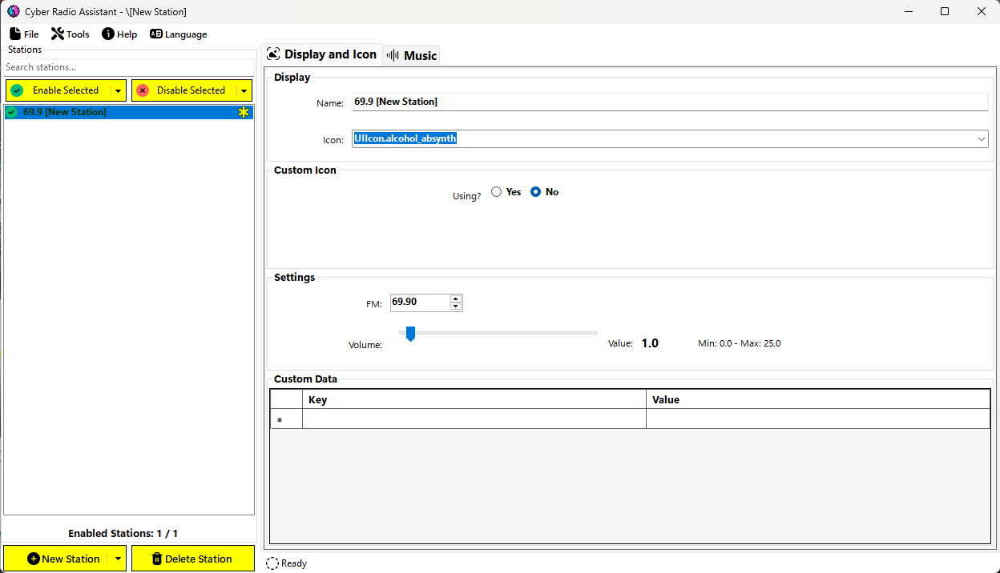

# Creating Stations

To create a new station, click the `New Station` button. The new station will appear in the left pane as `[New Station] 1`. Every new station you create will have its number incremented.

The right pane will update with the station's properties. This is where the majority of the customization takes place.

The `Display and Icon` tab contains properties related to how the station will appear and function in game.

The `Music` tab contains properties related to the audio for the station whether using a web stream or song files.

---
## Display and Icon Tab

### Display

- **Name** - specifies what the station is named in game and dictates the order of the station in game.
  
  > [!NOTE]
  > Special characters are allowed and will be escaped properly.

- **Icon** - this is the icon that the station will use when displayed in the radio station list. Select the icon you want to use from the drop-down; this drop-down also supports auto-complete. Most of these should work but I won't guarantee all of them do. Some trial and error here is expected 🤔.
  
  Unfortunately, at this time there is no way to show a preview of the icon in this application. That would require extracting each icon from the game files which is not an easy task.

### Custom Icon

You can also use a custom icon. If you are using a custom icon, the value you set for the `Icon` above will be ignored in favor of the values below.

- **Using?** - specifies if you want to use a custom icon. Most radio stations downloaded from [NexusMods](https://www.nexusmods.com/cyberpunk2077) will use a custom icon. This is properly displayed here when loading the station.
  
  If `Yes` is selected, two more options will appear, the `Ink Atlas Path` and the `Ink Atlas Part`:

  

- **Ink Atlas Path** - points to the `.inkatlas` that holds the icon texture, e.g. `base\gameplay\gui\world\vending_machines\atlas_roach_race.inkatlas`.

  > [!NOTE]
  > Backslashes are escaped properly here.

- **Ink Atlas Part** - specifies which part of the `.inkatlas` should be used for the icon, e.g. `gryphon_5`

> [!TIP]
> To create your own .inkatlas file, use [WolvenKit](https://github.com/WolvenKit/WolvenKit). Written tutorials can be found [here](https://wiki.redmodding.org/cyberpunk-2077-modding/for-mod-creators/modding-guides/custom-icons-and-ui).

### Settings

- **FM** - this is a number which is used to place the station at the right place in the stations list in game. If the `Name` has an FM number in it, it should be the same here. Though, currently this is not checked in the application.

- **Volume** - the overall volume multiplier for the station. You should make sure all of your songs have the same volume and then adjust the overall volume here to match up with the vanilla stations.
  
  If you are using a web stream, this can also help level out the volume of the stream if it's too loud.

  - Minimum: `0.0`
  - Maximum: `25.0`
  

  You can either use the slider **or** double-click the word `Value:` or the actual value to type in a number.

---
## Music Tab
