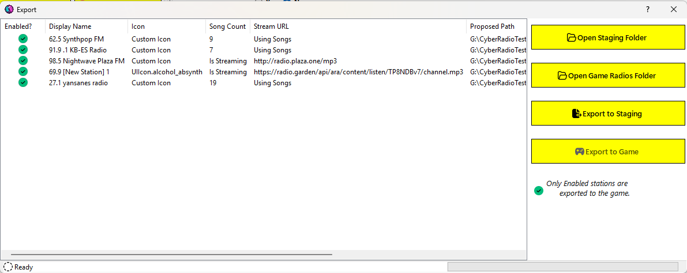
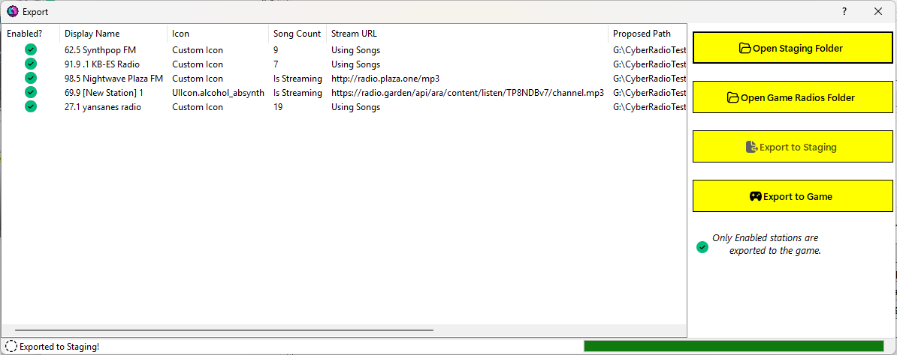
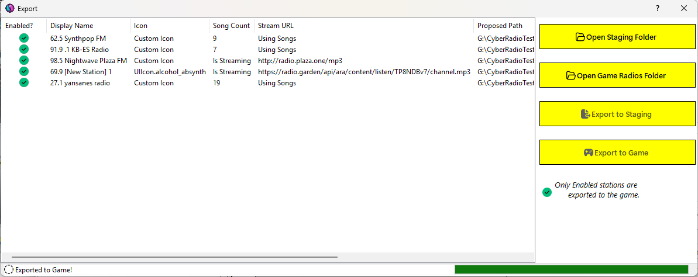

# Exporting Your Stations

Once you have created (or modified) your stations, you must export them. First, you have to export to the staging folder. Then, you can export the stations to the live game folder where they can be read by [radioExt](https://www.nexusmods.com/cyberpunk2077/mods/4591).

To get started exporting, click `File > Export Stations`. This will show the export dialog:

From this dialog you can:
- Open the current staging folder.
- Open the radios folder in the Cyberpunk 2077 directory. *Disabled if the radioExt mod is not installed*.
- Export the stations to staging.
- Export the stations from staging to the game.

The first thing you should do is review the information in the export list to ensure that it shows what you're expecting. The list will reflect some basic properties about the station as well as the proposed live path of the station after exporting to the game.

## Staging

If you need to make changes, you should probably export to staging first anyway as that acts as a sort of backup of your stations and persists them to disk. Up until you export to staging, all of your changes are done "in memory" only. That being said, nothing stops you from closing this dialog and making changes first.

When ready, click the `Export to Staging` button. The export task will run and the UI will update to reflect the current status. The status label at the bottom will show you the current station being exported and the progress bar will give you a visual indication of completion status. This is usally pretty fast so you may not even notice the individual stations being exported.

Once the export to staging has completed, the `Export to Staging` button will be disabled. The dialog expects you to export to the game next, but you can also close out of the dialog and click `File > Refresh Stations` to get an updated list of stations based on the most recent export.

**Any stations that you deleted from within CRA will also be deleted on disk after exporting to staging.**

> [!NOTE]
> If you decide to close the dialog between exports (i.e. closing after exporting to staging but before exporting to the game), you will have to perform the export to staging again before you can export to the game.

> [!WARNING]
> When you export the stations, a file not related to [radioExt](https://www.nexusmods.com/cyberpunk2077/mods/4591) is created: `songs.sgls`. This file is needed by CRA to keep track of the songs in the station. Since song files can reside anywhere on your disk, this file keeps the original file path of the songs as well as some metadata about the file.
> 
> 

>   
Example contents of <code>songs.sgls</code> file

>   <pre><code class="language-json">
>       [
>        {
>            "name": "2 Sad 4 Me.mp3",
>            "artist": "",
>            "duration": "00:00:14.9598750",
>            "size": 243402,
>            "original_path": "X:\\Files\\Music\\2 Sad 4 Me.mp3"
>        },
>        {
>            "name": "Surface Monstercat Release",
>            "artist": "Aero Chord",
>            "duration": "00:00:12.0408750",
>            "size": 192434,
>            "original_path": "X:\\Files\\Music\\Aero Chord Surface_2.mp3"
>        },
>        {
>            "name": "Dramatic Action",
>            "artist": "Horrorpen",
>            "duration": "00:02:48.6504375",
>            "size": 2698487,
>            "original_path": "X:\\Files\\Music\\HorrorPen - Dramatic Action mp3"
>        },
>        {
>            "name": "Sad Romance (Violin Ver.)",
>            "artist": "지평권",
>            "duration": "00:04:35.0636250",
>            "size": 4405028,
>            "original_path": "X:\\Files\\Music\\Sad Music - Violin.mp3"
>        },
>        {
>            "name": "Trndsttr - Lucian Remix.mp3",
>            "artist": "",
>            "duration": "00:02:59.8833750",
>            "size": 2878066,
>            "original_path": "X:\\Files\\Music\\Trndsttr - Lucian Remix.mp3"
>        }
>        ]
>   </code></pre>
> 

>
> 
> **If you delete this file, CRA will not be able to tell where your song files are located.**

## Game

Once you have made all of your changes to your stations, click the `Export to Game` button. This will begin copying your stations from the staging folder to the game folder. At any point, you can click `Open Game Radios Folder` to see what's been exported so far.

Again, the UI will update to reflect the export status showing the current station being exported and the completion status in the progress bar. This is usually quick but depending on the number of songs your stations have and the speed of your computer, it may take a few seconds to fully export.

> [!NOTE]
> The export to the game is simply copying the contents of your staging folder to the [radioExt](https://www.nexusmods.com/cyberpunk2077/mods/4591) `radios` folder. Thus, your staging folder is left untouched by the game. This allows you to make changes without affecting the game's live radios. 
> 
> *Also, exporting to the game does not delete station's folders from the game currently (unlike when exporting to staging).*

Once the exports are completed, both the `Export to Staging` and the `Export to Game` buttons will be disabled indicating a finished export operation. You can close this dialog and launch the game.

**Your stations should now show up in game!**