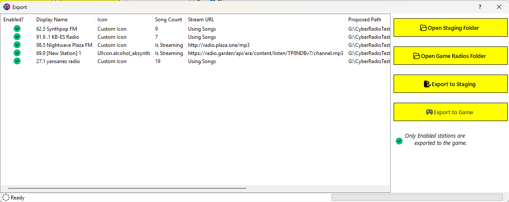
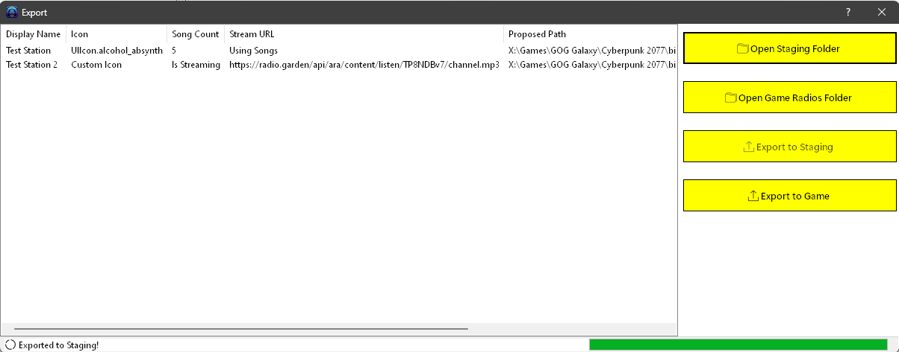

# Exporting Your Stations

Once you have created (or modified) your stations, you must export them. First, you have to export to the staging folder. Then, you can export the stations to the live game folder where they can be read by [radioExt](https://www.nexusmods.com/cyberpunk2077/mods/4591).

To get started exporting, click `File > Stations > Export Stations`. This will show the export dialog:

From this dialog you can:
- Open the current staging folder.
- Open the radios folder in the Cyberpunk 2077 directory.
  - *Disabled if the radioExt mod is not installed*.
- Export the stations to staging.
- Export the stations from staging to the game.
  - *Disabled if the radioExt mod is not installed*.

The first thing you should do is review the information in the export list to ensure that it shows what you're expecting. The list will reflect some basic properties about the station as well as the proposed live path of the station after exporting to the game. It will also indicate which stations are enabled by the green check (✅) mark next to the display name.

## Staging

If you need to make changes, you should probably export to staging first anyway as that acts as a sort of backup of your stations and persists them to disk. Up until you export to staging, all of your changes are done *"in memory"* only. That being said, nothing stops you from closing this dialog and making changes first.

When ready, click the `Export to Staging` button. The export task will run and the UI will update to reflect the current status. The status label at the bottom will show you the current station being exported and the progress bar will give you a visual indication of completion status. This is usally pretty fast so you may not even notice the individual stations being exported.

Once the export to staging has completed, the `Export to Staging` button will be disabled. The dialog expects you to export to the game next, but you can also close out of the dialog and make any necessary changes to the stations first.

If you have set the configuration option, *Auto-Export to Game* in CRA's configuration, then immediately after exporting to staging (upon success), the export window will begin exporting to the game.

> [!WARNING]
> Any stations that you deleted from within CRA will also be deleted on disk after exporting to staging.

> [!NOTE]
> If you decide to close the dialog between exports (i.e. closing after exporting to staging but before exporting to the game), you will have to perform the export to staging again before you can export to the game.

> [!WARNING]
> When you export the stations, a few files not related to [radioExt](https://www.nexusmods.com/cyberpunk2077/mods/4591) are created:
> - `songs.sgls`. This file is needed by CRA to keep track of the songs in the station. Since song files can reside anywhere on your disk, this file keeps the original file path of the songs as well as some metadata about the file.
> - `icons.icls` - this file is needed for custom icon support and has information related to the custom icons for a station (active or not).
> 
> 

>   
Example contents of <code>songs.sgls</code> file

>   <pre><code class="language-json">
>  [
>  {
>    "title": "Amphetamines (use me)",
>    "artist": "VIRA",
>    "duration": "00:03:09.8160000",
>    "file_size": 7592820,
>    "file_path": "D:\\Cyberpunk mods\\RadioExt\\RestoredStations\\66.6 Violent Vira FM\\Amphetamines (use me) - Violent Vira.mp3"
>  },
>  {
>    "title": "blood on the sheets…",
>    "artist": "VIOLENT VIRA",
>    "duration": "00:03:51.7680000",
>    "file_size": 9270822,
>    "file_path": "D:\\Cyberpunk mods\\RadioExt\\RestoredStations\\66.6 Violent Vira FM\\blood on the sheets... - Violent Vira.mp3"
>  },
>  {
>    "title": "Collar of Truth",
>    "artist": "VIRA",
>    "duration": "00:03:07.4400000",
>    "file_size": 7497774,
>    "file_path": "D:\\Cyberpunk mods\\RadioExt\\RestoredStations\\66.6 Violent Vira FM\\Collar of Truth - Violent Vira.mp3"
>  },
>  {
>    "title": "Frailty",
>    "artist": "VIRA",
>    "duration": "00:02:56.8560000",
>    "file_size": 7074406,
>    "file_path": "D:\\Cyberpunk mods\\RadioExt\\RestoredStations\\66.6 Violent Vira FM\\Frailty - Violent Vira.mp3"
>  },
>  {
>    "title": "God Complex (Prod. Anticøn)",
>    "artist": "VIOLENT VIRA",
>    "duration": "00:03:01.2480000",
>    "file_size": 7250028,
>    "file_path": "D:\\Cyberpunk mods\\RadioExt\\RestoredStations\\66.6 Violent Vira FM\\God Complex - Violent Vira.mp3"
>  },
>  {
>    "title": "I Don't Care Nightcore",
>    "artist": "VIRA",
>    "duration": "00:02:32.2560000",
>    "file_size": 6090423,
>    "file_path": "D:\\Cyberpunk mods\\RadioExt\\RestoredStations\\66.6 Violent Vira FM\\I Don't Care (Nightcore Mix) - Violent Vira.mp3"
>  },
>  {
>    "title": "I Don't Care - VIOLENT VIRA",
>    "artist": "VIOLENT VIRA",
>    "duration": "00:03:01.5840000",
>    "file_size": 7263467,
>    "file_path": "D:\\Cyberpunk mods\\RadioExt\\RestoredStations\\66.6 Violent Vira FM\\I Don't Care - Violent Vira.mp3"
>  },
>  {
>    "title": "I'll Save Myself This Time",
>    "artist": "VIOLENT VIRA",
>    "duration": "00:02:41.0160000",
>    "file_size": 6440746,
>    "file_path": "D:\\Cyberpunk mods\\RadioExt\\RestoredStations\\66.6 Violent Vira FM\\I'll Save Myself This Time - Violent Vira.mp3"
>  },
>  {
>    "title": "Lolita",
>    "artist": "VIOLENT VIRA",
>    "duration": "00:02:44.7120000",
>    "file_size": 6588566,
>    "file_path": "D:\\Cyberpunk mods\\RadioExt\\RestoredStations\\66.6 Violent Vira FM\\Lolita - Violent Vira.mp3"
>  },
>  {
>    "title": "LUKA",
>    "artist": "VIOLENT VIRA",
>    "duration": "00:03:29.3520000",
>    "file_size": 8374164,
>    "file_path": "D:\\Cyberpunk mods\\RadioExt\\RestoredStations\\66.6 Violent Vira FM\\Luka - Violent Vira.mp3"
>  },
>  {
>    "title": "She's Not Me (Official Music Video)",
>    "artist": "VIOLENT VIRA",
>    "duration": "00:03:06.3600000",
>    "file_size": 7454515,
>    "file_path": "D:\\Cyberpunk mods\\RadioExt\\RestoredStations\\66.6 Violent Vira FM\\She's Not Me - Violent Vira.mp3"
>  },
>  {
>    "title": "Tarantula Girl",
>    "artist": "VIOLENT VIRA",
>    "duration": "00:03:12.7680000",
>    "file_size": 7710814,
>    "file_path": "D:\\Cyberpunk mods\\RadioExt\\RestoredStations\\66.6 Violent Vira FM\\Tarantula Girl - Violent Vira.mp3"
>  },
>  {
>    "title": "Waiting outside a Hospital",
>    "artist": "VIRA",
>    "duration": "00:03:22.7280000",
>    "file_size": 8109305,
>    "file_path": "D:\\Cyberpunk mods\\RadioExt\\RestoredStations\\66.6 Violent Vira FM\\Waiting outside a Hospital - Violent Vira.mp3"
>  },
>  {
>    "title": "You Wanted More",
>    "artist": "VIOLENT VIRA",
>    "duration": "00:03:04.2000000",
>    "file_size": 7368095,
>    "file_path": "D:\\Cyberpunk mods\\RadioExt\\RestoredStations\\66.6 Violent Vira FM\\You Wanted More - Violent Vira.mp3"
>  },
>  {
>    "title": "you're not gone, you're just dead!",
>    "artist": "VIOLENT VIRA",
>    "duration": "00:02:51.4079999",
>    "file_size": 6856434,
>    "file_path": "D:\\Cyberpunk mods\\RadioExt\\RestoredStations\\66.6 Violent Vira FM\\you're not gone, you're just dead! - Violent Vira.mp3"
>  }
>]
>   </code></pre>
> 

>
>  

>   
Example contents of <code>icons.icls</code> file

>   <pre><code class="language-json">
> [
>   {
>     "iconId": "9f91537c-9579-42fa-a0b4-bc5bdefc3c72",
>     "iconPath": "D:\\Cyberpunk mods\\RadioExt\\RestoredStations\\icons\\awesome_station_logo.png",
>     "archivePath": "D:\\Cyberpunk mods\\RadioExt\\RestoredStations\\icons\\awesome_station_icon.archive",
>     "originalArchivePath": "C:\\Users\\Ethan\\AppData\\Roaming\\Wolven Icon Generator\\tools\\imported_working_directory\\awesome_station_icon-9f91537c-9579-42fa-a0b4-bc5bdefc3c72\\awesome_station_icon.archive",
>     "sha256HashOfArchiveFile": "6d41eeb459ac0dfb297b2753ffa8279b5d576135347e0adf0eea6a9ecac3878e",
>     "atlasName": "awesome_station_icon_69",
>     "iconName": "awesome station icon 69",
>     "isActive": false,
>     "customIcon": {
>       "inkAtlasPath": "base\\icon\\awesome_station_icon.inkatlas",
>       "inkAtlasPart": "icon_part"
>     },
>     "fromArchive": false,
>     "IconImage": null
>   },
>   {
>     "iconId": "278ea7ba-224d-4797-ab08-9b6987e41b63",
>     "iconPath": "D:\\Cyberpunk mods\\RadioExt\\RestoredStations\\icons\\archer_danger_zone.png",
>     "archivePath": "D:\\Cyberpunk mods\\RadioExt\\RestoredStations\\icons\\archer_danger_zone.archive",
>     "originalArchivePath": "C:\\Users\\Ethan\\AppData\\Roaming\\Wolven Icon Generator\\tools\\imported_working_directory\\archer_danger_zone-278ea7ba-224d-4797-ab08-9b6987e41b63\\archer_danger_zone.archive",
>     "sha256HashOfArchiveFile": "1dd0978220cc79ff14fa4f85340abe437dab8103814bbe7e90b210b77a9dfb6c",
>     "atlasName": "archer_danger_zone",
>     "iconName": "archer_danger_zone",
>     "isActive": true,
>     "customIcon": {
>       "inkAtlasPath": "base\\icon\\archer_danger_zone.inkatlas",
>       "inkAtlasPart": "icon_part"
>     },
>     "fromArchive": false,
>     "IconImage": "System.Drawing.Bitmap"
>   },
>   {
>     "iconId": "d43df8b9-932b-435f-8f27-455ac99d731e",
>     "iconPath": "D:\\Cyberpunk mods\\RadioExt\\RestoredStations\\icons\\Simple RF Generator in Compact Machine.png",
>     "archivePath": "D:\\Cyberpunk mods\\RadioExt\\RestoredStations\\icons\\simple_rf_generator_in_compact_machine.archive",
>     "originalArchivePath": "C:\\Users\\Ethan\\AppData\\Roaming\\Wolven Icon Generator\\tools\\imported_working_directory\\simple_rf_generator_in_compact_machine-d43df8b9-932b-435f-8f27-455ac99d731e\\simple_rf_generator_in_compact_machine.archive",
>     "sha256HashOfArchiveFile": "a99b4e48a9fa805167586b704cf99e0dda5d6675c3f386ae72ff8597f07827e5",
>     "atlasName": "simple_rf_generator_in_compact_machine",
>     "iconName": "Simple RF Generator in Compact Machine",
>     "isActive": false,
>     "customIcon": {
>       "inkAtlasPath": "base\\icon\\simple_rf_generator_in_compact_machine.inkatlas",
>       "inkAtlasPart": "icon_part"
>     },
>     "fromArchive": false,
>     "IconImage": null
>   }
> ]
>   </code></pre>
> 

> 
> **If you delete these files, CRA will not be able to tell where your song files are located or know what icons are associated with a station!**

## Game

Once you have made all of your changes to your stations, click the `Export to Game` button. This will begin copying your stations from the staging folder to the game folder. At any point, you can click `Open Game Radios Folder` to see what's been exported so far.

Again, the UI will update to reflect the export status showing the current item being exported and the completion status in the progress bar. This is usually quick but depending on the number of songs your stations have and the speed of your computer, it may take a few seconds to fully export.

> [!NOTE]
> The export to the game is copying the station from the staging folder to the [radioExt](https://www.nexusmods.com/cyberpunk2077/mods/4591) `radios` folder. Thus, your staging folder is left untouched by the game. This allows you to make changes without affecting the game's live radios.
> 
> Exporting to the game will also delete any stations marked as disabled from the game and remove their icons from the game, if any.

Once the exports are completed, both the `Export to Staging` and the `Export to Game` buttons will be disabled indicating a finished export operation. You can close this dialog and make further changes or launch the game.

**Your stations should now show up in game!**