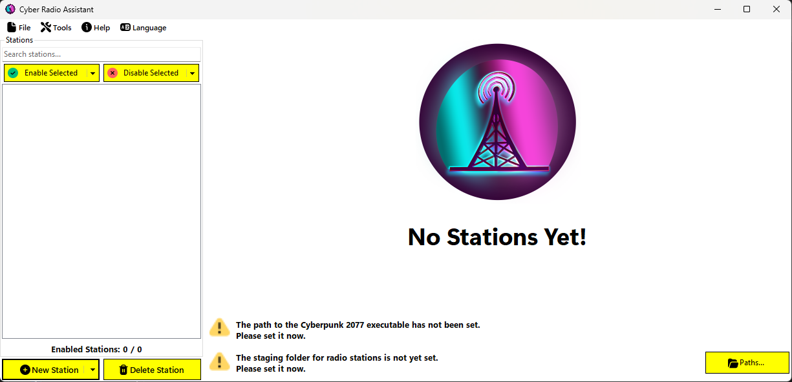
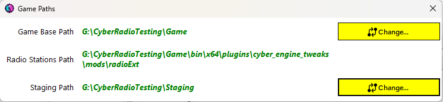
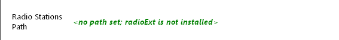
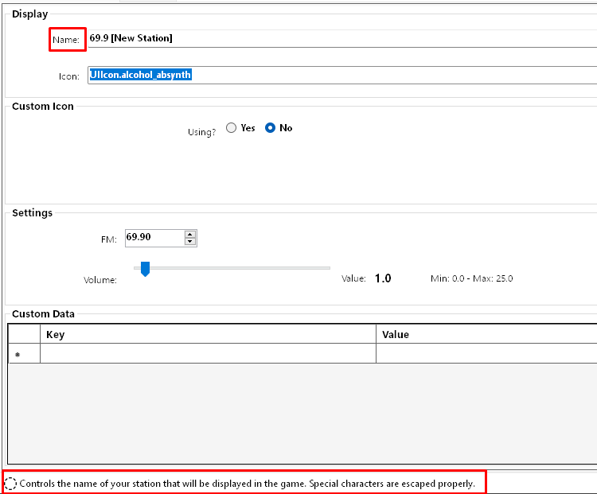

# Getting Started

This quick walkthrough shows how to get started using Cyber Radio Assistant (CRA).

Obviously, the first thing you should do is double-click the `.exe` to open it up. Upon first startup, you'll see this screen:

## Language
Next, make sure you choose your language if you are not English speaking. To do so, click `Language` in the menu bar:

Select your language from the options. Currently supported languages are:
- :gb: - English
- :fr: - French
- :es: - Spanish

## Paths

Since this is the first run, no paths have been set yet.

Click the `📁 Paths...` button to open the Path dialog:

Change the **Game Base Path** and the **Staging Path** as required.

> [!IMPORTANT]
> # [Game Base Path](#tab/GameBasePath)
> The base game path is where the `Cyberpunk2077.exe` is located. This will vary depending on where you bought the game (Steam or GOG).
> - **Steam**: `<Steam Install Directory>\steamapps\common\Cyberpunk 2077\bin\x64\Cyberpunk2077.exe`
> - **GOG**: `<GOG Install Directory>\Games\Cyberpunk 2077\bin\x64\Cyberpunk2077.exe`
>
> You should adjust these paths based on your system and where you store your games.
>
> # [Staging Path](#tab/StagingPath)
> This is where you want to store your custom radio stations before copying them to the game.
> 
> This can be anywhere you want on your computer but keep in mind, if you change this location after setting it, **your radio stations will not be copied to the new location**.
>
> Any radio stations that are in this `Staging` folder will be read by CRA upon starting. This is the primary "working directory" for the application.
>
> ---

Once the paths are set, the **Radio Stations Path** will update accordingly:

If the [radioExt](https://www.nexusmods.com/cyberpunk2077/mods/4591) mod is not installed, the **Radio Stations Path** will indicate this and you will not be able to copy custom stations to the game directory:

Once the paths have been set, exit out of the dialog and the main window should update to reflect that the application is ready.

## User Interface

The UI is split into two main parts:
- The left pane (or the stations list box) is a list of stations that currently reside in your staging path.
- The right pane (or the station's properties) is a dynamic pane that will update based on the selected station. *You may have already noticed that if you have no stations, this pane reflects that!*

These two panes are seperated by a split-bar. This means you can resize each pane by hovering between them until the splitter cursor appears, ↔️, and dragging left or right.

The station's properties pane also contains tabs to seperate the display properties from the audio properties.

### Resizing

The main window of the application does not allow minimizing or maximizing, however, you can resize the window by dragging from one of the corners manually. The application will remember its size on subsequent runs.

### Get Help

Most of the labels on the station's properties pane provide help when hovered over them. For example, if you hover over `Name:`, the bottom status bar will display the help entry for the text box:

At any point, you can click the `?` at the top right of the window to open this documentation. The export window also has a `?` on it that will open the help page for exporting stations.

This documentation can also be opened from `Help > How To Use` in the main menu bar.

# Next Steps

**You are now ready to [create some stations](stations.md)!**