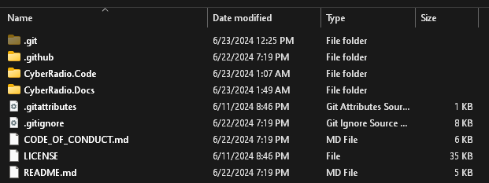

# Localization

Cyber Radio Assistant supports three languages currently:

- :gb: - English
- :fr: - French
- :es: - Spanish

If you wish to provide translations for the application, that's awesome! 🥳 There is one major prerequiste you MUST meet if you want to translate the application:

**An ability to read and understand English (the primary language the application was built for) as well as being fluent in the language you are translating to.**

If you can do that, great! Let's get started.

---

There are two main ways you can provide translations:

1. Using an IDE (like [Visual Studio 2022](https://visualstudio.microsoft.com/vs/) or [IntelliJ's Rider IDE](https://www.jetbrains.com/rider/)). *This guide will **not** go in depth on how to use these IDEs.*

    **-or-**

2. Manually translating strings to a text file and submitting a pull request.

Both ways will be covered here.

# Using an IDE to Translate

To use the IDE method, you should first clone the `main` branch of the repo.

1. In a new directory on your computer, run this command from a command prompt: 

    <pre><code language="language-git">gh repo clone ethan-hann/CyberRadio-Assistant</code></pre>

2. Inside the repo, you should have a few folders like below:
   
   

3. Navigate and open up the file: `CyberRadio.Code > RadioExt-Helper.sln` in the IDE of your choice.

# WIP