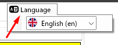
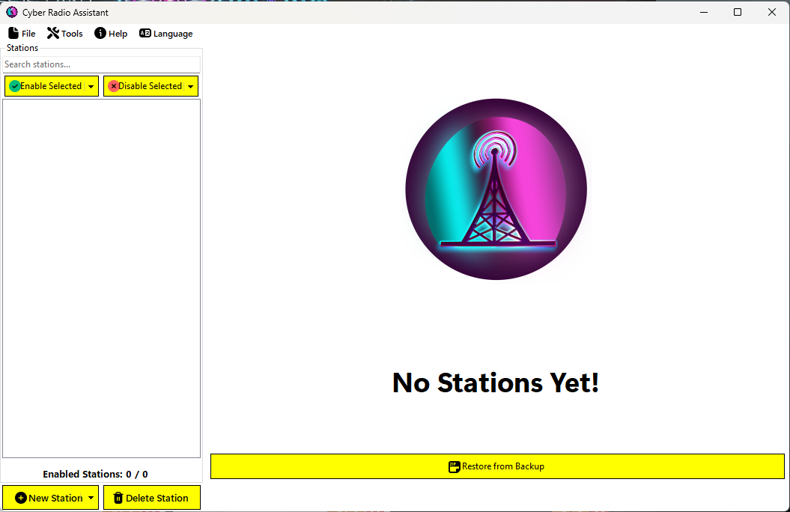

# Getting Started

This quick walkthrough shows how to get started using Cyber Radio Assistant (CRA).

Obviously, the first thing you should do is double-click the `.exe` to open it up. Because I'm not paying exorbiants amount of money to do [code-signing](https://codesigncert.com/blog/code-signing-certificate-cost), you may see the warning from Windows Smartscreen.

Just click `More info` and `Run anyway`:

Upon startup, you'll see the splash screen:

The splash screen will begin loading the application, initialize settings, performing migration (if needed), and check for updates. The top left of the splash screen will show the current version of the application running. The bottom text shows what CRA is doing while starting up.

Once finished, the main window of the application will open:

## Language
Before continuing, make sure you choose your language if you are not English speaking. To do so, click `Language` in the menu bar:

Select your language from the options. Currently supported languages are:

- **English** 🇺🇸
- **Español (Spanish)** 🇪🇸
- **Français (French)** 🇫🇷
- **Deutsch (German)** 🇩🇪
- **Italiano (Italian)** 🇮🇹
- **Português (Portuguese)** 🇵🇹
- **Русский (Russian)** 🇷🇺
- **中文 (Chinese)** 🇨🇳

## Paths

Since this is the first run, no paths have been set yet.

Click the `📁 Paths...` button to open the Path dialog:

Change the **Game Base Path** and the **Staging Path** as required.

> [!IMPORTANT]
> # [Game Base Path](#tab/GameBasePath)
> The base game path is where the `Cyberpunk2077.exe` is located. This will vary depending on where you bought the game (Steam or GOG).
> - **Steam**: `<Steam Install Directory>\steamapps\common\Cyberpunk 2077\bin\x64\Cyberpunk2077.exe`
> - **GOG**: `<GOG Install Directory>\Games\Cyberpunk 2077\bin\x64\Cyberpunk2077.exe`
>
> You should adjust these paths based on your system and where you store your games.
>
> # [Staging Path](#tab/StagingPath)
> This is where you want to store your custom radio stations before copying them to the game.
> 
> This can be anywhere you want on your computer but keep in mind, if you change this location after setting it, **your radio stations will not be copied to the new location**.
>
> Any radio stations that are in this `Staging` folder will be read by CRA upon starting. This is the primary "working directory" for the application.
>
> ---

Once the paths are set, the **Radio Stations Path** will update accordingly:

If the [radioExt](https://www.nexusmods.com/cyberpunk2077/mods/4591) mod is not installed, the **Radio Stations Path** will indicate this and you will not be able to copy custom stations to the game directory. You will still be able to export to the staging directory though:

Once the paths have been set, exit out of the dialog and the main window should have updated to reflect that the application is ready.

## Configuration

CRA has a configuration file that is used to set some settings and properties for how the application behaves. The configuration file is located at `%localappdata%\RadioExt-Helper\config.yml` on your computer and is created with defaults (or migrated from v1.0.0) when CRA first runs. 

> [!NOTE]
> You are welcome to try and make configuration changes via a text editor but the main way these settings should be changed is from within CRA.

Navigate to `File > Configuration` in the main menu to open the configuration window:

Hovering your mouse over the options displays more information about that option in the status bar at the bottom of the window.

Sensible defaults have been set already and should be fine for most users. However, some options that you may want to change depending on your setup are the `Default Song Location` and the `Check for Updates at Startup?` options.

### Default Song Location

This option defines the location that song files are stored at when you are importing a station from a `.zip` file. Each station will have its own folder within this location that contains the songs for that station. This is mainly used when you've downloaded a station from [NexusMods](https://www.nexusmods.com/cyberpunk2077/) and are importing it.

### Check for Updates at Startup?

This option will enable CRA to check for updates duing its startup (while still on the splash screen initialization). You may want to disable this option if you find the `No Updates Available` pop-up annoying everytime the app starts up. But, you will have to manually check for updates using `Help > Check For Updates` menu option from time to time.

## Getting Help

Most of the labels and controls across various panes and windows provide help when hovered over them. For example, if you hover over `Name:`, the bottom status bar will display the help entry for the text box:

At any point, you can press `F1` on the keyboard or click the `Help > How To Use` menu item to open this documentation. The export window also has a `?` on it that will open the help page for exporting stations.

# Next Steps

To understand the UI layout a bit more, see the [User Interface](user-interface.md) article

**-or-**

if you're feeling adventurous, how about [creating some stations](../stations/creating-stations.md)?