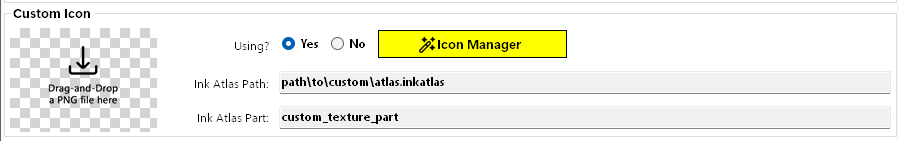
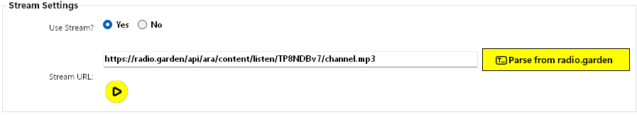
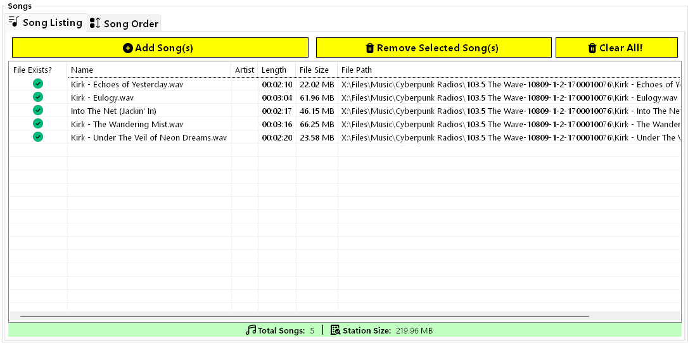
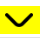
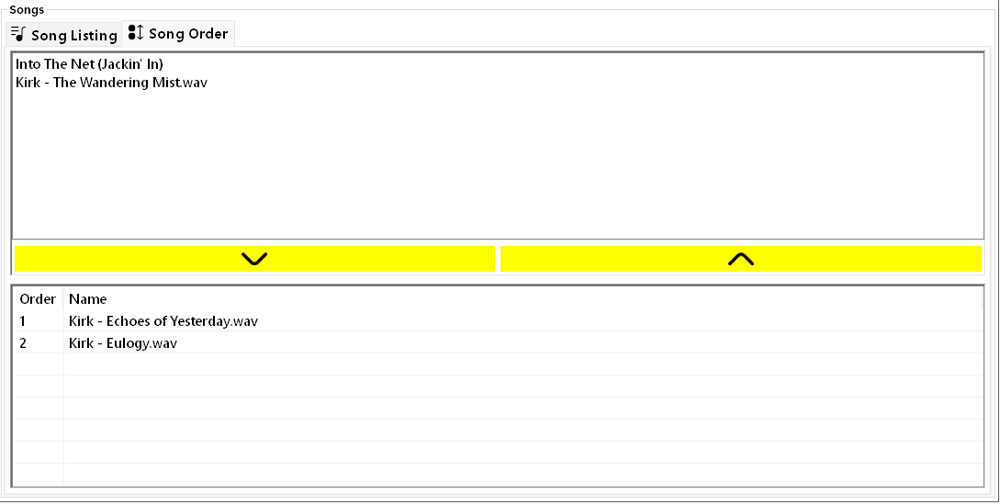
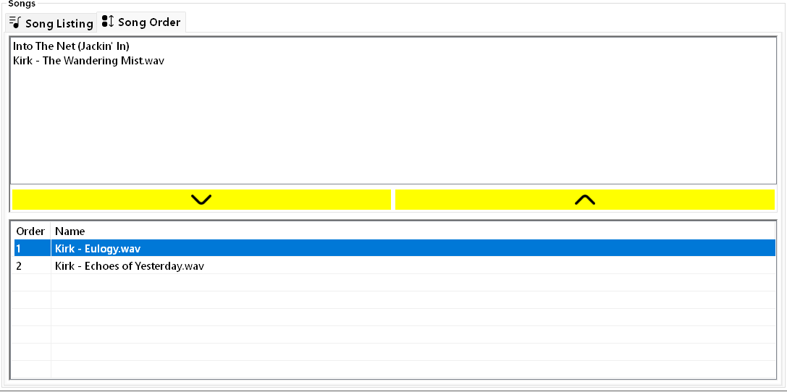

# Creating Stations

To create a new station, click the `New Station` button. The new station will appear in the left pane as `[New Station] 1`. Every new station you create will have its number incremented.

The right pane will update with the station's properties. This is where the majority of the customization takes place.

> [!TIP]
> There exists a bug currently where sometimes the new station won't get "selected" properly and thus display its properties in the right pane. Simply click the station name in the left pane manually if this happens.

The `Display and Icon` tab contains properties related to how the station will appear and function in game.

The `Music` tab contains properties related to the audio for the station whether using a web stream or song files.

---
## Display and Icon Tab

### Display

- **Name** - specifies what the station is named in game and dictates the order of the station in game. When you change the name here, the changes will not be updated in the stations list until an export and refresh has occured.

  The station will still appear to have the "old" name in the stations list.
  
  > [!NOTE]
  > Special characters are allowed and will be escaped properly.

- **Icon** - this is the icon that the station will use when displayed in the radio station list. Select the icon you want to use from the drop-down; this drop-down also supports auto-complete. Most of these should work but I won't guarantee all of them do. Some trial and error here is expected 🤔.
  
  Unfortunately, at this time there is no way to show a preview of the icon in this application. That would require extracting each icon from the game files which is not an easy task.

### Custom Icon

You can also use a custom icon. If you are using a custom icon, the value you set for the `Icon` above will be ignored in favor of the values below.

- **Using?** - specifies if you want to use a custom icon. Most radio stations downloaded from [NexusMods](https://www.nexusmods.com/cyberpunk2077) will use a custom icon. This is properly displayed here when loading the station.
  
  If `Yes` is selected, two more options will appear, the `Ink Atlas Path` and the `Ink Atlas Part`:

  

- **Ink Atlas Path** - points to the `.inkatlas` that holds the icon texture, e.g. `base\gameplay\gui\world\vending_machines\atlas_roach_race.inkatlas`.

  > [!NOTE]
  > Backslashes are escaped properly here.

- **Ink Atlas Part** - specifies which part of the `.inkatlas` should be used for the icon, e.g. `gryphon_5`

> [!TIP]
> To create your own .inkatlas file, use [WolvenKit](https://github.com/WolvenKit/WolvenKit). Written tutorials can be found [here](https://wiki.redmodding.org/cyberpunk-2077-modding/for-mod-creators/modding-guides/custom-icons-and-ui).

### Settings

- **FM** - this is a number which is used to place the station at the right place in the stations list in game. If the `Name` has an FM number in it, it should be the same here. Though, currently this is not checked in the application.

- **Volume** - the overall volume multiplier for the station. You should make sure all of your songs have the same volume and then adjust the overall volume here to match up with the vanilla stations.
  
  If you are using a web stream, this can also help level out the volume of the stream if it's too loud.

  - Minimum: `0.0`
  - Maximum: `25.0`
  

  You can either use the slider **or** double-click the word `Value:` or the actual value to type in a number.

---
## Music Tab

This is where the real magic 🪄 happens! The Music tab allows you to specify if you want to use a web stream for the audio source of the station **or** individual audio files instead.

### Stream Settings

- **Use Stream?** - by default, the station is set to not use a stream. However, this can be changed here. By selecting `Yes`, the `Songs` group box will be hidden and the stream settings will show another option: `Stream URL`.

The `Stream URL` can be any web audio stream (usually a URL that ends in `.mp3` or similar).

Some examples of streams can be found [here](https://truck-simulator.fandom.com/wiki/Radio_Stations#Radio_Stations_by_country), but also most stations from [Radio Garden](https://radio.garden/) can be used with [some tweaking](using-radio-garden-streams.md).

> [!TIP]
> You can preview the web audio stream by clicking the yellow play button beneath the `Stream URL` input: 
>
> If the stream doesn't work here, it probably won't work in game either!
> 
> Be wary of the volume though! It might be quite loud depending on the stream. If it's too loud here, it will probably be too loud in the game and you should adjust the `Volume` on the `Display and Icon` tab.

### Songs

If you don't want to use a stream and instead opt to use audio files, you can configure that here.

#### Song Listing

##### Adding Songs
To add songs, click the `Add Song(s)` button on the `Song Listing` tab.

This will open a file selection where you can select one or more supported audio files. Supported formats are below:

| Audio Format | Extension |
| :----------: | :-------: |
|     MP3      |  `.mp3`   |
|     Wave     |  `.wav`   |
|     Ogg      |  `.ogg`   |
|     Flac     |  `.flac`  |
|     MP2      |  `.mp2`   |
|     Wax      |  `.wax`   |
|     Wma      |  `.wma`   |

**The audio files can be added from anywhere on your computer and do not have to be in the staging folder already. They will be copied upon exporting.**

Once the songs have been added to the station, they will appear in the list view along with some properties about the song:

- *`Clicking`* a header (like `Name`) will sort the list view based on that column. This has no effect on the station and is purely for visual effect.
- *`Double-Clicking`* a song in the list view will open the containing folder for that song file on your computer in Windows Explorer.

> [!NOTE]
> It's important to note that nothing has been copied or touched on your file system at this point. Everything is done "in memory" until you initiate an export.

##### Removing Songs
   
To remove songs, click the `Remove Selected Song(s)` button on the `Song Listing` tab. You must have selected one or more songs in the list view first. 

To select a single song, simply click its name in the list. To select multiple songs, you can either `Ctrl + Click` the songs or drag from an empty space in the list across all of the songs.

Once your songs are selected, click the remove button to delete them from the station. If you selected all of the songs, you will get a warning dialog:

This is to help prevent accidental removals of all songs in the station.

#### Song Order

Once you have added the songs for the station, you are basically done! However, there is one more optional step if you want to edit the order of the songs. [radioExt](https://www.nexusmods.com/cyberpunk2077/mods/4591) allows for songs to be ordered in the station.

Basically, any songs in the order will be played **in order** as they appear. Any song not in the order will be played randomly either before or after the ordered songs.

> [!WARNING]
> You should not add every song in the station to the order unless that's what you want. The default functionality of [radioExt](https://www.nexusmods.com/cyberpunk2077/mods/4591) plays songs in random order making for a more realistic radio station.

- To add a song to the order, make sure it is selected in the panel above the ordered list and click the  button. 

  Multiple songs can be selected here similar to the `Song Listing` list view; either by `Ctrl + Click` or dragging from an empty space over the song names.

  

  Once added to the ordered list below the buttons, songs can be re-arranged by dragging thier name in the ordered list below the buttons. Simply drag-and-drop the songs in the order you want.

  In this example, I've re-ordered `Dramatic Action` to be played before `Trndsttr - Lucian Remix.mp3`:

  

- To remove a song from the order, select it in the ordered list and click the  button. This will return it back to the unordered list above the buttons and remove it from the order.

> [!NOTE]
> If you remove a song from the station all together, it will also remove it from the ordered list.

**Once you've set all of the station's properties, you are ready to [export](export.md)!**

# Removing Stations

To remove a radio station, make sure it is selected in the `Stations` list and click the `Delete Station` button at the bottom left.

> [!WARNING]
> There is no warning that you're deleting a station; it will simply just disappear 💨
> 
> If you haven't [exported](export.md) the station yet to the staging folder, then it's gone for good. Otherwise, you can click `File > Refresh Stations` to re-read the staging folder and bring it back (minus whatever changes you've made).
>
> **Be sure you really want to delete the station!**