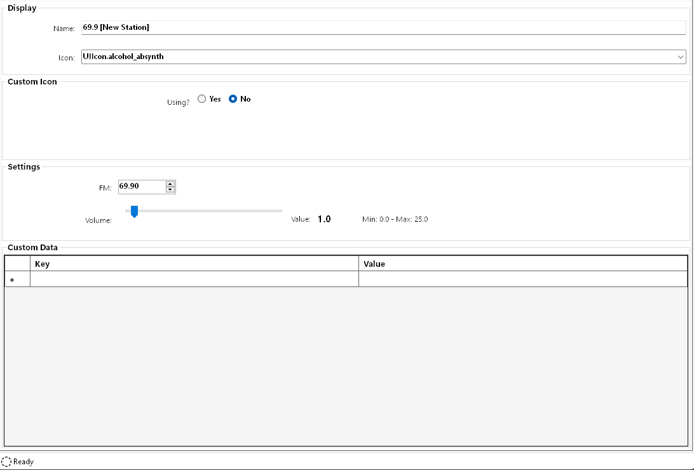

# Display and Icon Tab

This tab allows you to set the various properties and settings for a station in relation to how its displayed in game.

Let's go through the various options you have to configure a station.

### Display

- **Name** - specifies what the station is named in game and dictates the order of the station in game. When you change the name here, the changes will be immediately reflected in the station list on the left. All station's are required to have the FM number as the first part of the display name and this will be automatically added based on the `FM:` setting below.

  > [!NOTE]
  > Special characters are allowed and will be escaped properly.

- **Icon** - this is the icon that the station will use when displayed in the radio station list in game. Select the icon you want to use from the drop-down; this drop-down also supports auto-complete. Most of these should work but I won't guarantee all of them do. Some trial and error here is expected 🤔.
  
  Unfortunately, there is no way to show a preview of the icon in this application. That would require extracting each icon from the game files which is not feasable.

### Custom Icon

You can also use a custom icon. If you are using a custom icon, the `Icon` entry above will be disabled.

- **Using?** - specifies if you want to use a custom icon. Most radio stations downloaded from [NexusMods](https://www.nexusmods.com/cyberpunk2077) will use a custom icon. This is properly displayed here when loading the station.
  
  If `Yes` is selected, a few more options will appear:

  

- **Ink Atlas Path** - points to the `.inkatlas` that holds the icon texture, e.g. `base\icon\icon.inkatlas`.

- **Ink Atlas Part** - specifies which part of the `.inkatlas` should be used for the icon, e.g. `icon_part`

  The *Ink Atlas Path* and *Ink Atlas Part* are not user-editable. You may notice that you can drag-and-drop a `.png` file into the icon's preview to the left. Doing so will immediately open the `Icon Manager` where all custom icon management for a station takes place. Also, when a station is imported (either via drag-and-drop, or a .zip file), its icon is automatically added to the station.
  
  This *Quick Guide* will not cover creating and managing custom icons, however this is covered in depth here: [Custom Icons](../icons/custom-icons.md).
  
  For now, we'll leave the `Using?` option set to **No** to keep the default game icon.

### Settings

- **FM** - this is a number which is used to place the station at the right place in the stations list in game. If the `Name` has an FM number in it, it should be the same here. This constraint is checked and will update based on the display name for the station and vice-versa.

- **Volume** - the overall volume multiplier for the station. You should make sure all of your songs have the same volume and then adjust the overall volume here to match up with the vanilla stations.
  
  If you are using a web stream, this can also help level out the volume of the stream if it's too loud.

  - Minimum: `0.0`
  - Maximum: `25.0`

  You can either use the slider **or** double-click the word `Value:` or the actual value to type in a number.

### Custom Data

This is a table of custom data that is stored alongside this station. You are free to add any custom `key-value` pair to this table that you want. This can be used to track the download URL for a station on Nexus or maybe any notes you want to associate with the station.

This table is used by CRA as well to track the active icon for a station and will dynamically change depending on the icon selected as active. All data that is added by CRA to this table is read-only. More details on this functionality are covered in [Custom Icons](../icons/custom-icons.md).