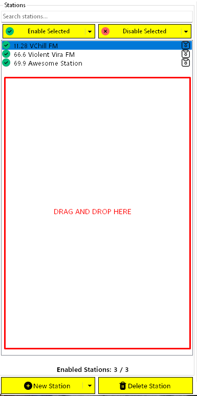
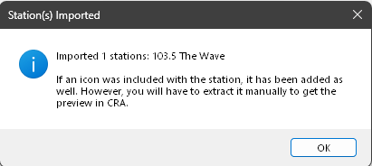
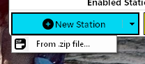
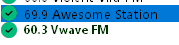

# Importing Stations

CRA is able to handle the importing of `.zip` and `.rar` stations downloaded from [NexusMods](https://www.nexusmods.com/cyberpunk2077).

There are two ways to import stations:

1. Drag-and-drop a station's `.zip` or `.rar` file into the station's list.
2. Click the `New Station > From .zip file...` button on the main window.

## Drag and Drop a Station

Simply drag a download station and drop it within the empty space in the station's list. It will immediately be imported into CRA. The import may take a few seconds to complete if it's a large station or multiple stations.

> [!TIP]
> You can drag-and-drop multiple station `.zip` or `.rar` files at once. They will be processed sequentially and a single dialog will be shown indicating success.

Once complete, you will get a dialog indicating success:

and the station will be selected in the list to show it's properties.

> [!IMPORTANT]
> As the dialog states, CRA handles the custom icon as well. However, you will have to manually extract the icon to get the correct properties from the `.archive` file and to set it as active for the station. Failure to do so will result in the icon not being exported to the game.
> 
> If you don't open the `Icon Manager` after importing the station, the properties for the icon will be set and be included in the resulting `metadata.json` file for the station, but the actual `.archive` file will not be exported to the game until it has been extracted in CRA.
>
> This means that the game will have no knowledge of the icon since it's file will not be in the game's `archive/pc/mod` folder.
>
> For more information on icon management, see the [Custom Icons](../icons/custom-icons.md) article.

## New Station > From .zip file...

You can also import a station from a `.zip` or `.rar` file by clicking the drop-down next to the `New Station` button and clicking `From .zip file...`:

This will open a file dialog where you can select one or more station files to import. Similarly to the drag-and-drop method, they will be imported immediately upon clicking `Open` in this dialog.

## UI Notes

When importing a station, that station's display name in the list will be a <b>dark green color</b> and bolded indicating it is an imported station.

After exporting to staging, the color will be changed to the default black to indicate it is no longer considered *imported* by CRA.