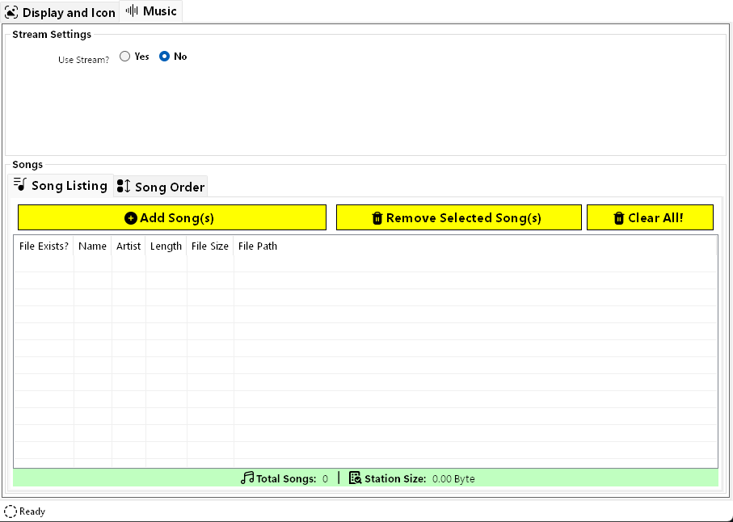
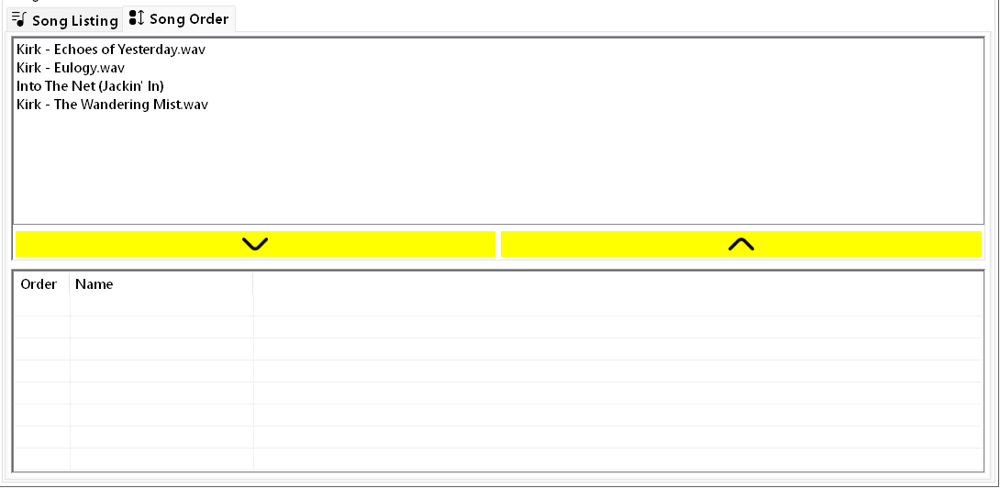

# Music Tab

The Music tab allows you to specify if you want to use a web stream for the audio source of the station **or** individual audio files instead.

## Stream Settings

- **Use Stream?** - by default, the station is not set to use a stream. However, this can be changed here. By selecting `Yes`, the `Songs` pane will be hidden and the stream settings will show another option: `Stream URL`.

The `Stream URL` can be any web audio stream (usually a URL that ends in `.mp3` or similar).

Some examples of streams can be found [here](https://truck-simulator.fandom.com/wiki/Radio_Stations#Radio_Stations_by_country), but also most stations from [Radio Garden](https://radio.garden/) can be used with [some tweaking](../advanced-topics/using-radio-garden-streams.md).

If you don't want to manually tweak the URL, you can press `Parse from radio.garden` to bring up a parse dialog.

Here you can enter the actual web URL displayed in your browser and CRA will automatically parse it into the correct API URL for streaming.

> [!TIP]
> You can preview the web audio stream by clicking the yellow play button beneath the `Stream URL` input: 
>
> If the stream doesn't work here, it probably won't work in game either!
> 
> **Be wary of the volume though!** It might be quite loud depending on the stream. If it's too loud here, it will probably be too loud in the game and you should adjust the `Volume` on the [`Display and Icon`](display-and-icon-tab.md) tab.

## Songs

If you don't want to use a stream and instead opt to use audio files, you can configure that here.

### Adding Songs
To add songs, click the `Add Song(s)` button on the `Song Listing` tab.

This will open a file selection where you can select one or more supported audio files. Supported formats are below:

| Audio Format | Extension |
| :----------: | :-------: |
|     MP3      |  `.mp3`   |
|     Wave     |  `.wav`   |
|     Ogg      |  `.ogg`   |
|     Flac     |  `.flac`  |
|     MP2      |  `.mp2`   |
|     Wax      |  `.wax`   |
|     Wma      |  `.wma`   |

> [!TIP]
> The audio files can be added from anywhere on your computer and do not have to be in the staging folder already. They will be copied to the game upon exporting and are linked to the station.

Once the songs have been added to the station, they will appear in the list view along with some properties about the song:

*Clicking* a header (like `Name`) will sort the list view based on that column. This has no effect on the station and is purely for visual effect.

*Double-Clicking* a song in the list view will open the containing folder for that song file on your computer in Windows Explorer.

The bottom of the songs pane will show you the total number of songs in the station as well as the current station size on disk. The station size is mainly just the total size of all of the song files as the other files are miniscule size in relation.

To select a single song, simply click its row in the list. To select multiple songs, you can either `Ctrl + Click` the songs or drag from an empty space in the list across all of the songs.

> [!NOTE]
> Nothing has been copied or touched on your file system at this point. Everything is done *"in memory"* until you initiate an export.

#### Missing Song Files

If a song file is missing after being added to the station in CRA, the UI will reflect this. There will be an ❌ next to the song(s) that have missing files. Songs with missing files will not be exported to the game. However, you are not prevented from exporting the station.

In order to tell CRA where this song file is, right-click the missing song and click `Locate Missing Song`:

A file dialog will open allowing you to select where the song file is located.

> [!IMPORTANT]
> You will only be able to choose a file with the same name as the original song file. If you change the name of the song file, you will have to delete and re-add the song to the station.

Once selected, the UI will update to reflect the file path and status of the located song.

If you have multiple song files missing from the station, you can multi-select songs in the list, right-click them, and click `Locate Missing Songs...`. This will open a folder dialog where you can choose the containing folder for the song files.

> [!IMPORTANT]
> All missing songs should be in the same folder for this method to work. They should also be named correctly based on the original song file. If they are not in the same folder, use the single locate method instead.

### Removing Songs
   
To remove one or more songs, click the `Remove Selected Song(s)` button on the `Song Listing` tab. You must have selected one or more songs in the list first.

Once your songs are selected, click the remove button to delete them from the station. If you selected all of the songs, you will get a warning dialog:

This is to help prevent accidental removals of all songs in the station.

You can also click the `Clear All!` button to achieve the same effect.

## Song Order

Once you have added the songs for the station, you have the option to configure the song order. [radioExt](https://www.nexusmods.com/cyberpunk2077/mods/4591) allows for songs to be ordered in the station.

Any songs in the order will be played **in the order** as they appear. Any song not in the order will be played randomly either before or after the ordered songs.

> [!WARNING]
> You should not add every song in the station to the order unless you're sure that's what you want. The default functionality of [radioExt](https://www.nexusmods.com/cyberpunk2077/mods/4591) plays songs in [pseudo random](https://en.wikipedia.org/wiki/Pseudorandomness) order making for a more realistic sounding radio station.

To add a song to the order, make sure it is selected in the panel above the ordered list and click the  button. 

  Multiple songs can be selected here similar to the `Song Listing` list view; either by `Ctrl + Click` or dragging from an empty space over the song names.

  

  Once added to the ordered list below the buttons, songs can be re-arranged by dragging thier name in the ordered list below the buttons. Simply drag-and-drop the songs in the order you want.

  In this example, I've re-ordered `Kirk - Eulogy` to be played before `Kirk - Echoes of Yesterday`:

  

To remove a song from the order, select it in the ordered list and click the  button. This will return it back to the unordered list above the buttons and remove it from the order.

> [!NOTE]
> If you remove a song from the station all together, it will also remove it from the ordered list.