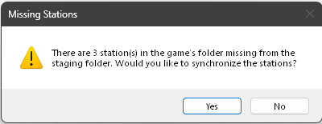

# Station Syncing

Once you've set up valid game and staging folder paths, any subsequent runs of CRA will check the game's radios folder for stations. If it finds any stations that aren't also in the staging folder, you will be presented with this dialog:

Selecting `Yes` here will *sync* the staging and game's radios folder essentially copying the station from the game to the staging folder.

> [!TIP]
> At any time while CRA is open, you can perform this sync through the `File > Stations > Synchronize Stations` menu option. This will sync only the stations that are not present in staging. It will not overwrite stations that haven't been exported yet (i.e., new and/or imported stations).

## Directory Watcher

In addition to syncing, CRA also (by default) watches the game's `radios` folder for changes. This means that you can extract a station to this folder and CRA will pick up the station automatically and add it to the staging folder. This is best used for stations with no custom icon as the watcher **will not** sync the icons.

For stations with custom icons, you should [import](../stations/importing-stations.md) them instead from within CRA.

This setting can be changed from the [configuration settings](../quick-start/getting-started.md#configuration).