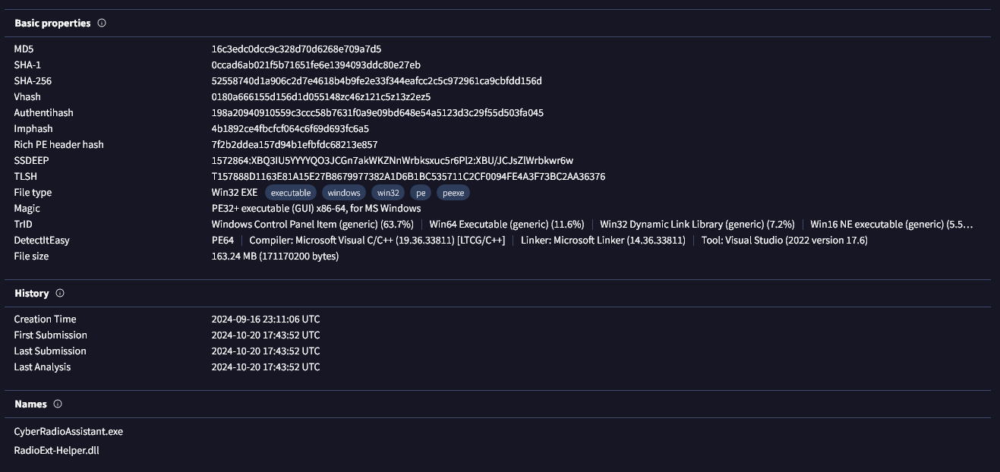

 

# Welcome to Cyber Radio Assistant! 📻

Cyber Radio Assistant is a standalone tool that helps you create and manage custom radio stations for the Cyberpunk 2077 mod, [radioExt](https://www.nexusmods.com/cyberpunk2077/mods/4591).

A brief list of features are below:

- **Create custom radio stations** using a GUI application instead of editing a `metadata.json` file.
- **Manage radio stations** downloaded from [NexusMods](https://www.nexusmods.com/cyberpunk2077/), with options to modify their metadata or playlist.
- **Add and delete songs** from your station, including songs from NexusMods.
- **Export stations to a staging folder** to avoid affecting your game directory directly.
- **Add a web stream** as a radio station instead of local audio files, and preview the stream from within the app.
- **Create and manage custom icons** for your stations, including integration with [Wolven Icon Generator (WIG)](https://github.com/ethan-hann/WolvenIconGenerator) for `.archive` file creation.
- **Localization** support for multiple languages, including English, Español, Français, Deutsch, Italiano, Português, Русский, and 中文.
- **Asynchronous task support** for background operations like icon generation, with progress tracking and cancellation.
- **User-friendly interface** with a clean and intuitive UI with drag-and-drop functionality for adding songs and icons. Detailed tooltips and user guidance simplify station setup and management.

This documentation has two parts:
1) A [**full guide**](docs/quick-start/introduction.md) that goes over how to use Cyber Radio Assistant 📃
2) An [**API reference**](api/RadioExt_Helper.forms.yml) that is useful if you want to see the classes and methods behind the scenes 😄

## Documentation Language Support
Currently, `docfx` does not provide a nice way to generate multi-language documentation, so these docs only support English.

  
<b>VirusTotal Report</b>

Since you should never run `.exe` files from people you don't trust, I urge you to verify the hash of the file you downloaded against the below.

Also, check the VirusTotal report. There was 1 detection out of 70 but it is a false positive. If you don't believe me, look through the [source code](https://github.com/ethan-hann/CyberRadio-Assistant) and tell me where the virus is.

## Summary

- **File Name:** `CyberRadioAssistant.exe`
- **SHA-256:** 
`52558740d1a906c2d7e4618b4b9fe2e33f344eafcc2c5c972961ca9cbfdd156d`
- **Detection Ratio:** 1/70
- **Date:** 2024-10-20 17:43:52 UTC

## Detailed Report

For the full VirusTotal report, please visit the following link:

[View VirusTotal Report](https://www.virustotal.com/gui/file/52558740d1a906c2d7e4618b4b9fe2e33f344eafcc2c5c972961ca9cbfdd156d/detection)

## Key Findings

- **Antivirus Detections:** 
  - Symantec: **`Clean`**
  - McAfee: **`Clean`**
  - Kaspersky: **`Clean`**
  - Avast: **`Clean`**
  - BitDefender: **`Clean`**
  - Bkav Pro: `W64.AIDetectMalware` (**FALSE POSITIVE**)
  - MaxSecure: **`Clean`**

## Screenshots

Here are some screenshots from the VirusTotal report:

### Detection Overview

### Detailed Analysis

  
<b>TODO List</b>

> [!TODO]  
> Implement editing of song's title within CRA.

> [!TODO]  
> Add station preview that allows previewing what the station would look and sound like in game.

> [!TODO]  
> Add a way to normalize the audio levels of station's songs.

